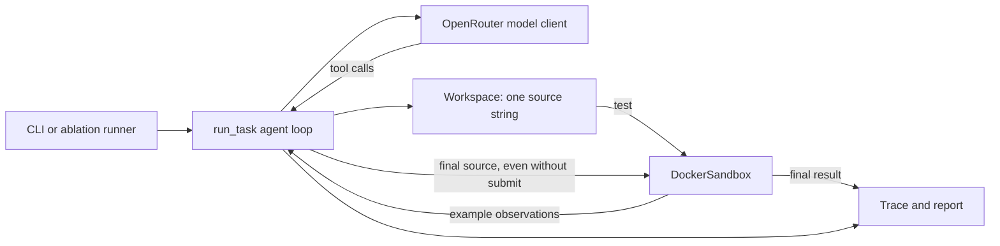

# ACI Patch Agent: technical orientation

## Start here: the purpose of Weeks 1 and 2

These are small engineering exercises. Week 1 builds a working coding-agent loop;
Week 2 practices comparing two tool configurations. Neither introduces a new model
or establishes general coding ability. The same agent supports both exercises;
Week 2 adds the comparison around it.

| Week | Exact goal | What changes from the previous week | Evidence and limits |
| --- | --- | --- | --- |
| 1 | Make a model read, edit, test, and explicitly submit a repair; grade it independently. | Establish the first complete loop and run the five development tasks once each. | 3/5 completed repairs. This shows the implementation can run; it does not establish a capability improvement. |
| 2 | Measure whether accepting versus rejecting syntactically invalid edits changes completed repairs. | Reuse the loop; use ten different tasks, two editor modes, and three repetitions per task and mode. | Checked 30/30; unchecked 29/30. No checked attempt triggered syntax rejection, so the result does not demonstrate that runtime rejection caused the difference. |

Week 1 versus Week 2 is a change in exercise scope. It is not a controlled
before/after score comparison: the task sets differ. Within Week 2, the two modes
use the same ten tasks and budgets. The syntax check and its tool description
change together, which also limits attribution.

### Week 1: command, code flow, and one result

**Learning goal:** connect a model response to a real tool operation, feed the
observation back, and save an independently graded result. There is no novel
research hypothesis in implementing this loop.

From this repository's root, with the environment installed as in the README:

```sh
python -m aci_patch_agent run --task normalize-method --output runs/week1-example
```

This makes live paid model calls and uses Docker. Choose a new output directory.
`run` is the subcommand registered in `cli.main()`, not a Python function called
`run`. Python first executes `aci_patch_agent/__main__.py`:

Source: [aci_patch_agent/__main__.py](aci_patch_agent/__main__.py#L1), lines 1–3. Exact excerpt:

```python
from .cli import main

main()
```

The CLI defines the subcommand and task selector:

Source: [aci_patch_agent/cli.py](aci_patch_agent/cli.py#L24), lines 24–28. Exact excerpt:

```python
def main():
    parser = argparse.ArgumentParser(description="Run a small coding agent and publish inspectable results.")
    commands = parser.add_subparsers(dest="command", required=True)
    run = commands.add_parser("run", help="Run live model calls; OPENROUTER_API_KEY is required.")
    run.add_argument("--task", choices=["all"] + [t.id for t in TASKS], default="all")
```

After argument parsing, Docker preflight, task selection, and writing `run.json`,
the CLI calls the loop and saves its returned dictionary:

Source: [aci_patch_agent/cli.py](aci_patch_agent/cli.py#L68), lines 68–73. Exact excerpt:

```python
    for task in tasks:
        print(f"Running {task.id} ...", flush=True)
        result = run_task(task, client, sandbox, max_actions=args.max_actions, max_total_tokens=args.max_total_tokens)
        (args.output / f"{task.id}.json").write_text(json.dumps(result, indent=2) + "\n")
        print(f"  {result['status']}, {result['actions']} actions", flush=True)
    print(report(args.output))
```

```text
python -m aci_patch_agent run ...
  __main__.py → cli.main()
    select normalize-method from TASKS; write run.json
    run_task(task, client, sandbox)
      create Workspace with task.source
      send issue + source to OpenRouterClient.complete(messages)
      parse the model's tool name and JSON arguments
      Workspace.execute(name, args)
        view: return numbered lines
        edit: validate and update Workspace.source
        test: DockerSandbox.check(task, source), examples only
        submit: request completion
      append observation to messages; ask model for its next action
      current loop: first submit requests review; later submit can finish
      stop on submission or a budget/error/stall
      DockerSandbox.check(task, source, final=True)
      return events, responses, source, patch, evaluation, submitted, passed
    write runs/week1-example/normalize-method.json
    report(output) → results.csv + summary.md
```

**Where the source changes:** `Workspace.source` is a string in memory. `edit`
replaces lines in that string. The sandbox writes a temporary `solution.py` when
running checks; the model does not edit the repository's task or grader files.

For `normalize-method`, the original function returns `str(method)`. Given
`b"GET"`, that produces the string `"b'GET'"`; the issue requires `"GET"`.
The model must write a repair, and final grading includes cases beyond the two
examples. [Task definition](aci_patch_agent/tasks.py#L23).

**Historical result versus current code:** the saved
[Week 1 attempt](results/week1-five-tasks/normalize-method.json) passed in four
actions. The current loop includes later stall handling and submission review,
described below. Those features were not responsible for the historical 3/5 score.
The original [run record](results/week1-five-tasks/run.json) preserves the source
hashes and Git revision recorded at execution; hashes identify executed file
contents even when a working tree differed from its commit.

### Week 2: command, changed behavior, and six clamp files

**Learning goal:** run a declared comparison and inspect whether the proposed
mechanism was actually exercised. Checking syntax is an unsurprising guard.
`unchecked` is the comparison condition that removes that guard; the experiment
does not establish a practical advantage to disabling it.

```sh
python -m aci_patch_agent.ablation --output runs/week2-example
```

This calls `ablation.main()`, a separate experiment entry point. It runs all ten
evaluation tasks in both modes, three times each: 60 fresh attempts. It does not
call `cli.main()` and does not use the five Week 1 development tasks.

The runner translates the mode into the editor configuration and description:

Source: [aci_patch_agent/ablation.py](aci_patch_agent/ablation.py#L25), lines 25–32. Exact excerpt:

```python
    def runner(task, condition, repeat):
        checked = condition == "checked"
        client = OpenRouterClient(tools=tool_schemas(checked))
        return run_task(task, client, sandbox, workspace_factory=partial(Workspace, checked=checked))
    metadata = {"experiment": "edit-syntax-check", "model": DEFAULT_MODEL, "temperature": 0,
                "max_actions": 15, "max_tokens": 1200, "max_total_tokens": 32000, "image": image,
                "system_prompt": SYSTEM_PROMPT, "tool_schemas": {c: tool_schemas(c == "checked") for c in ["checked", "unchecked"]}}
    print(execute_matrix(args.output, EVAL_TASKS, ["checked", "unchecked"], 3, runner, metadata))
```

`partial(Workspace, checked=checked)` supplies a function that makes a new workspace
with the requested setting. `repeat` labels a fresh attempt; this runner does not
use it as a random seed or change the prompt with it.

This is the actual syntax gate inside `Workspace.execute`:

Source: [aci_patch_agent/tools.py](aci_patch_agent/tools.py#L60), lines 60–68. Exact excerpt:

```python
            if self.checked:
                try:
                    compile(candidate, "solution.py", "exec")
                except (SyntaxError, ValueError) as error:
                    return {"accepted": False, "error": f"{type(error).__name__}: {error}. Source unchanged."}
            if not candidate.strip():
                return {"error": "Empty source is not accepted. Source unchanged."}
            self.source = candidate
            return {"accepted": True, **self.execute("view", {})}
```

When `checked` is false, execution skips `compile(...)`; ordinary argument/range
validation and behavioral tests still exist. Compiling accepts valid syntax, not
necessarily a correct implementation.

```text
python -m aci_patch_agent.ablation ...
  ablation.main()
    execute_matrix(output, EVAL_TASKS, [checked, unchecked], 3, runner, metadata)
      declare every task/mode/repetition in manifest.json
      for each declared attempt, using two worker threads:
        runner(task, condition, repeat)
          configure tool description + Workspace.checked
          run_task(...) with a fresh workspace and conversation
          grade the final source and return its record
        add id/task/condition/repeat to that record
        write <task>--<condition>--<repeat>.json
      summarize_matrix(output) → results.csv + summary.json + summary.md
```

The exact identity and write logic in the shared runner is:

Source: [aci_patch_agent/experiment.py](aci_patch_agent/experiment.py#L20), lines 20–22. Exact excerpt:

```python
    attempts = [{"id": f"{task.id}--{condition}--{repeat}", "task": task.id,
                 "condition": condition, "repeat": repeat}
                for repeat in range(1, repeats + 1) for task in tasks for condition in conditions]
```

After calling the per-attempt runner:

Source: [aci_patch_agent/experiment.py](aci_patch_agent/experiment.py#L34), lines 34–35. Exact excerpt:

```python
        result.update(attempt)
        (output / f"{attempt['id']}.json").write_text(json.dumps(result, indent=2) + "\n")
```

For clamp, that produces these six independent records. The table shows the
**saved Week 2 traces**, not a prediction of future model output:

| Saved record | Model's actions | Final result |
| --- | --- | --- |
| [clamp--checked--1.json](results/week2-edit-check/clamp--checked--1.json) | view → edit → test → submit | Submitted; 6 checks passed |
| [clamp--checked--2.json](results/week2-edit-check/clamp--checked--2.json) | view → view → edit → test → submit | Submitted; 6 checks passed |
| [clamp--checked--3.json](results/week2-edit-check/clamp--checked--3.json) | view → edit → test → submit | Submitted; 6 checks passed |
| [clamp--unchecked--1.json](results/week2-edit-check/clamp--unchecked--1.json) | view → edit → test → submit | Submitted; 6 checks passed |
| [clamp--unchecked--2.json](results/week2-edit-check/clamp--unchecked--2.json) | view → view → edit → test → submit | Submitted; 6 checks passed |
| [clamp--unchecked--3.json](results/week2-edit-check/clamp--unchecked--3.json) | view → view → edit → test → submit | Submitted; 6 checks passed |

All six begin with the same broken `return min(value, high)` function. They do not
inherit another attempt's repair. For example, checked repetition 1 asks to view
lines 1–2, replaces lines 1–2 with a bounds check and `max(low, min(value, high))`,
runs the two examples, and submits. The agent then runs all six final checks.

The Week 2 manifest's agent source hashes match commit `b2ba36f`. Its saved runs
predate the current loop's submission-review and stall features. A new run uses
the installed implementation and can produce a different trace.

**What was learned:** the comparison infrastructure works, and all attempts are
inspectable. The checked side's runtime syntax guard was never triggered in these
30 attempts. The 30/30 versus 29/30 score therefore does not establish that rejecting
an invalid edit caused the improvement. [Detailed interpretation](EXPERIMENTS.md).

To rebuild the saved table without running a model or tests:

```sh
python -m aci_patch_agent.ablation --report-only --output results/week2-edit-check
```

The remainder of this document describes the current implementation in more detail.

This guide is for an agent encountering this repository for the first time. It
describes the implementation at commit `0e8d2fe`. The [README](README.md)
provides setup and published results; [WEEK_BY_WEEK.md](WEEK_BY_WEEK.md) records
the broader study plan. Read the code for the contract of a new run.

## What the system does

ACI means **agent-computer interface**: the tools and observations through which
a model works on a task. This project gives a model one broken Python function,
an issue describing its required behavior, and four tools. The model can inspect
and replace lines, run example checks, and submit. A separate evaluator runs all
checks on the resulting function. It is a small experiment in tool feedback and
task completion, not a general repository repair agent.



The main modules are:

| Module | Responsibility |
| --- | --- |
| [`tasks.py`](aci_patch_agent/tasks.py) and [`eval_tasks.py`](aci_patch_agent/eval_tasks.py) | Define five development tasks and ten separate comparison tasks. Each task holds an issue, initial source, two examples, and additional final cases. |
| [`tools.py`](aci_patch_agent/tools.py) | Advertise the four tools and hold the only editable state: a `Workspace.source` string. |
| [`agent.py`](aci_patch_agent/agent.py) | Run the model/tool/observation loop, count budgets, handle stalls, request submission review, and record the trace. |
| [`client.py`](aci_patch_agent/client.py) | Call OpenRouter's chat completions API with required tool choice. |
| [`sandbox.py`](aci_patch_agent/sandbox.py) | Execute generated Python in Docker and compare actual outputs with expected values on the host. |
| [`cli.py`](aci_patch_agent/cli.py), [`ablation.py`](aci_patch_agent/ablation.py), [`experiment.py`](aci_patch_agent/experiment.py), [`report.py`](aci_patch_agent/report.py) | Run individual tasks or the edit comparison, preserve attempts, and build offline summaries. |

## Follow one task through the loop

The numbered walkthrough and line anchors below preserve the September 30
baseline. The October 3 changes are recorded immediately after the walkthrough.

1. A [`Task`](aci_patch_agent/tasks.py#L13-L20) supplies the function name,
   issue, broken source, example cases, and additional evaluation cases. For
   instance, `normalize-method` starts with `return str(method)`, which mishandles
   byte strings and invalid types ([`tasks.py`](aci_patch_agent/tasks.py#L23-L32)).
2. [`run_task`](aci_patch_agent/agent.py#L49-L89) creates a `Workspace`, sends the
   issue and initial source to the model, and asks for tool calls. The default
   provider client uses `qwen/qwen3-next-80b-a3b-instruct`, temperature 0,
   1,200 completion tokens per request, and `tool_choice: required`
   ([`client.py`](aci_patch_agent/client.py#L10-L29)).
3. Each returned call consumes one action. The loop executes it through
   `Workspace.execute`, saves the observation, and sends that observation back
   before the next model response. A response with no tool call or malformed JSON
   also consumes an action; a response with several calls can consume several
   actions ([`agent.py`](aci_patch_agent/agent.py#L81-L103)).
4. The first valid `submit` returns the current source and issue as a review
   request. It does **not** finish the run. A later model response can submit the
   same source or make another edit first. This is a prompt to inspect the work,
   not an independent code review or proof of correctness
   ([`agent.py`](aci_patch_agent/agent.py#L138-L175)).
5. On termination, the sandbox evaluates the current source against examples
   **and** additional cases, even if the model did not submit. `passed` is true
   only when it submitted and final evaluation passed. A correct final source
   without submission still fails the agent run
   ([`agent.py`](aci_patch_agent/agent.py#L194-L212)).

**October 3 update:** submission review now asks for a check of every requirement,
including types, exceptions, and boundary cases. A repeated rejected edit gets a
warning; the third identical rejection on the same source ends the run. All edit
rejections, including malformed calls, participate in that guard. Invalid `test`
calls preserve failure history. The one-time recovery also detects a return to an
earlier example failure after edits, including alternating failures. An actual
pass or runner error clears that history; budgets and the single restart remain.

A sandbox `RuntimeError` during a tool call or final grading now returns
`sandbox_error` with the recorded events and responses. After a tool-side sandbox
exception, final grading is skipped to avoid retrying a sandbox whose cleanup may
have failed. Malformed provider responses such as `choices: null` become
`api_error`. The CLI can save these results and continue the remaining tasks.
These changes have regression coverage; their effect on live model success rates
has not been measured.

## The tool contract

`view` returns numbered lines, at most 100 per call. `edit` replaces a
one-based, inclusive line range; accepted edits return the updated view.
`test` executes only the two example cases. `submit` asks the loop to finish.
The model cannot invoke a shell or edit the grader through this interface
([`tools.py`](aci_patch_agent/tools.py#L14-L71)).

The default checked editor compiles the candidate source before accepting it.
Invalid syntax, invalid ranges, empty source, unchanged replacements, and source
over 16 KiB do not change `Workspace.source`. Compilation checks syntax, not
behavior. The `unchecked` comparison mode removes only the syntax check and
changes the tool description to say so; other edit guards still apply
([`tools.py`](aci_patch_agent/tools.py#L25-L71)).

At the September 30 baseline, the loop had two bounded stall responses. Repeating the same edit that returned
`accepted: false` against the same source ends with `stuck`. If a changed source
produces exactly the same failing example details as the previous failed test,
the loop can rebuild the conversation once with the current source and a concise
record of edits and tests. A second such failure after the restart ends with
`stuck`. The restart retains action and token usage; it does not reveal final
evaluation cases ([`agent.py`](aci_patch_agent/agent.py#L105-L137),
[`agent.py`](aci_patch_agent/agent.py#L179-L193)).

The default action limit is 15. The 32,000 reported-token limit is checked
**before** the next model call, so the last response can pass the threshold.
An API error, token limit, action limit, or stall can end a run without submission.
The trace preserves the resulting status and final evaluation
([`agent.py`](aci_patch_agent/agent.py#L49-L80),
[`agent.py`](aci_patch_agent/agent.py#L194-L212)).

## Execution and scoring boundary

The host keeps expected answers. For a `test` call, the sandbox receives the
candidate source and example inputs; for final evaluation it receives example
and additional inputs. A fresh container executes the named function, returns
values or exception names, and the host compares them with the cases. Values
must have the same Python type and value as expected; exception cases compare
exception class names ([`sandbox.py`](aci_patch_agent/sandbox.py#L30-L70)).

Docker runs as a non-root user with no network, a read-only filesystem and
read-only source mount, dropped capabilities, process/memory/CPU limits, output
limit, and a timeout. There is no host execution fallback. These controls bound
this experiment; the container runner is not a hardened service for adversarial
submissions ([`sandbox.py`](aci_patch_agent/sandbox.py#L72-L119),
[`README`](README.md#tools-and-grading)).

The task sets are authored, public fixtures. Additional cases are withheld from
the live model's `test` tool, but they are readable in this repository. Treat the
score as performance on these tasks, not as a held-out benchmark or a SWE-bench
result ([`tasks.py`](aci_patch_agent/tasks.py),
[`eval_tasks.py`](aci_patch_agent/eval_tasks.py)).

## Run artifacts and evidence

`python -m aci_patch_agent run` creates a **new** output directory. `run.json`
records settings, task and source hashes, tool schemas, prompt, Git revision,
and Docker image identity. Each `<task>.json` records model responses, tool
events and observations, source before and after, a unified patch, final
evaluation, usage, and duration. `results.csv` and `summary.md` are derived from
those files ([`cli.py`](aci_patch_agent/cli.py#L24-L73),
[`agent.py`](aci_patch_agent/agent.py#L199-L212)). The `report` command rebuilds
the table offline; it does not call a model or re-execute a saved patch
([`report.py`](aci_patch_agent/report.py)).

The edit comparison uses a declared 10-task × 2-mode × 3-repeat matrix. Its
manifest fixes the attempt list before execution; missing attempts and runner
errors remain failures in the denominator. `experiment.py` runs attempts with
two workers and writes each trace separately
([`ablation.py`](aci_patch_agent/ablation.py),
[`experiment.py`](aci_patch_agent/experiment.py#L16-L86)). The published first
five-task run passed 3/5; the checked-versus-unchecked comparison passed 30/30
versus 29/30. These saved results predate the current recovery and submission
review logic, so do not attribute those scores to the current loop
([`results/week1-five-tasks/summary.md`](results/week1-five-tasks/summary.md),
[`results/week2-edit-check/summary.md`](results/week2-edit-check/summary.md)).

## First steps for a new agent

From this repository's root, install as described in the [README](README.md),
then use these commands according to the question you are answering:

```sh
python -m aci_patch_agent tasks
python -m unittest discover -s tests -v
ACI_DOCKER_TESTS=1 python -m unittest discover -s tests -v
python -m aci_patch_agent report results/week1-five-tasks
python -m aci_patch_agent.ablation --report-only --output results/week2-edit-check
```

The first test command needs neither Docker nor an API key. The second runs
container checks. Both report commands use saved data and make no model calls.
A new `run` or non-report `ablation` call needs Docker, a new output directory,
and `OPENROUTER_API_KEY`; it incurs provider cost
([`cli.py`](aci_patch_agent/cli.py#L24-L53),
[`ablation.py`](aci_patch_agent/ablation.py#L17-L35),
[`tests/test_sandbox.py`](tests/test_sandbox.py#L18-L47)).

For a change to an observation or tool, start in `tools.py`, then trace how
`agent.py` records and feeds it back. For a grading change, inspect `sandbox.py`
and the task definitions together. For a score or reproducibility question,
inspect the exact saved trace and its `run.json` or matrix manifest before
summarizing a result. The scripted clients in `tests/` check loop mechanics;
they are not evidence of live model ability.
